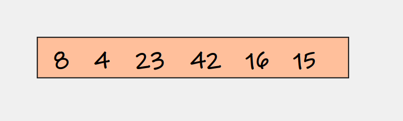
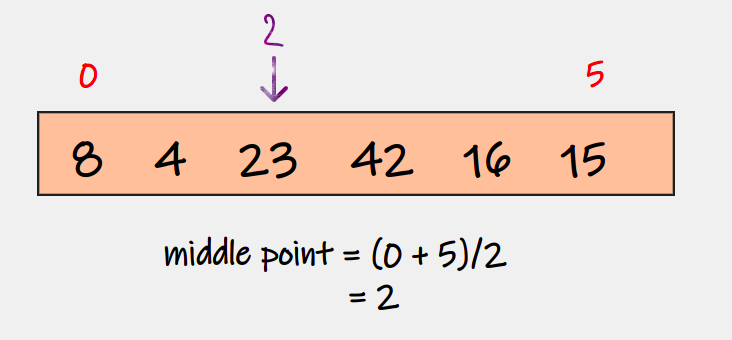
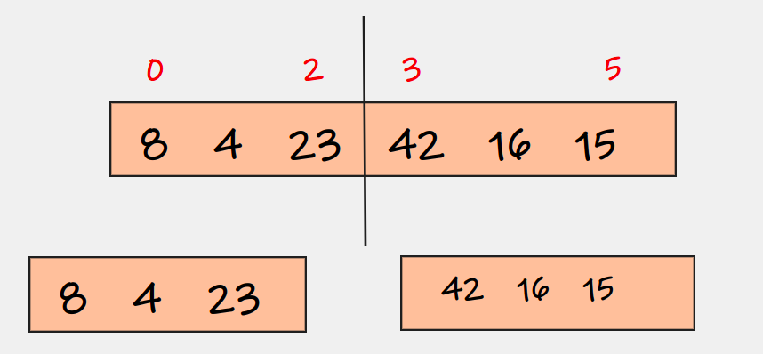
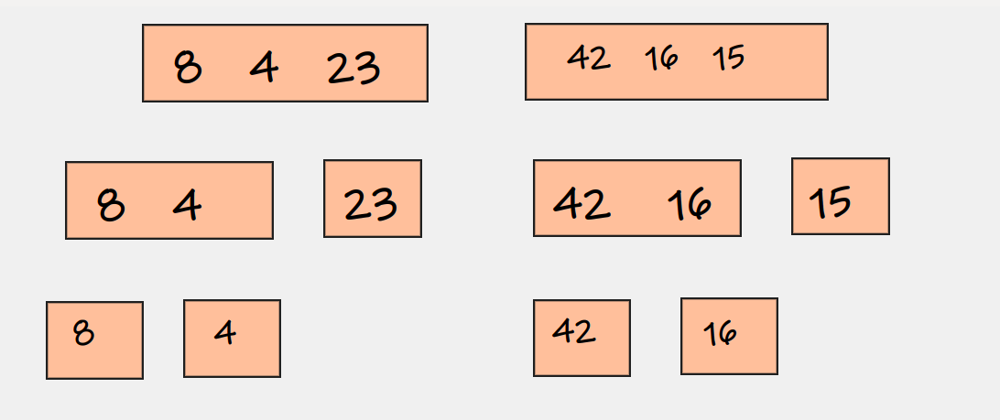
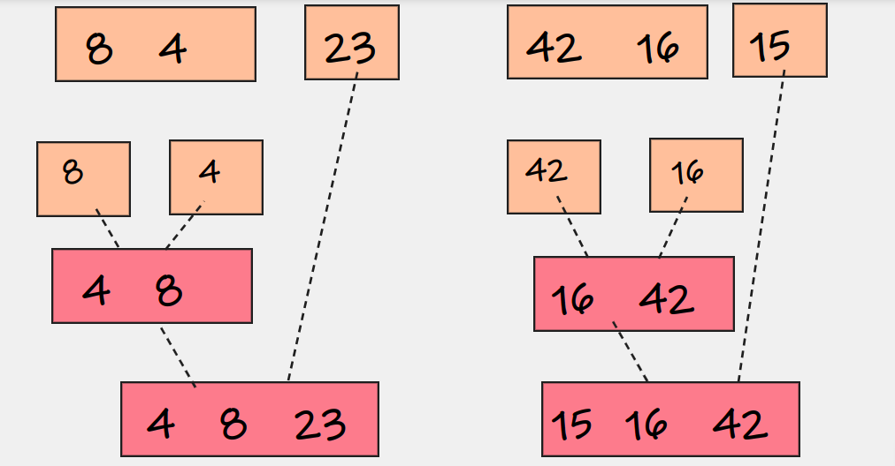
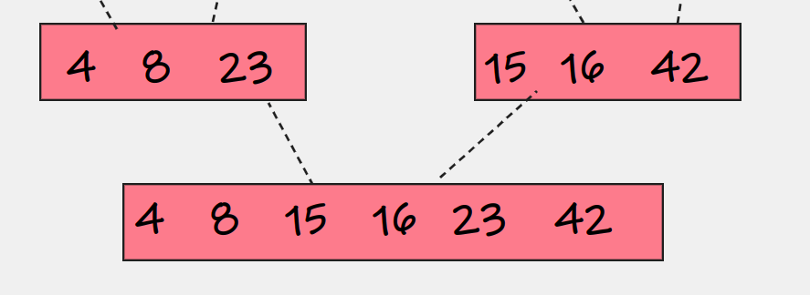

# Selection Sort

## Definition

---

MergeSort*1  is an efficient, general-purpose, and comparison-based sorting algorithm. Most implementations produce a stable sort, which means that the order of equal elements is the same in the input and output.

- The merge sort based on divide-and-conquer principle

## Algorithm Rules

---

We have two main stage

**FIRST STAGE:**
1. divide the main of the array in two sub-array using middle equation `middle = (lower bond + upper bond) / 2`

2. based on the recursion, the division operation is still working until the sub-array has 1 element.

**SECOND STAGE**

3. sort the sub-array.

4. merge the sorted sub-array into 1 array

## Efficiency

---

**The time Complexity:**

- The average case : O(nlogn)

**The Space Complexity** is O(1)

## Example

---

1. Assume we have this array and we want to sort it using the merge sort:

2. we will use the equation to divide this array into two sub-array `middle = lower bond + Upper bond / 2`

3. still working until each of the sub-array has 1 element

4. we will merge and sort the sub-array

## Resources

##### [*1 Wikipedia](https://en.wikipedia.org/wiki/Merge_sort#:~:text=In%20computer%20science%2C%20merge%20sort,in%20the%20input%20and%20output.)