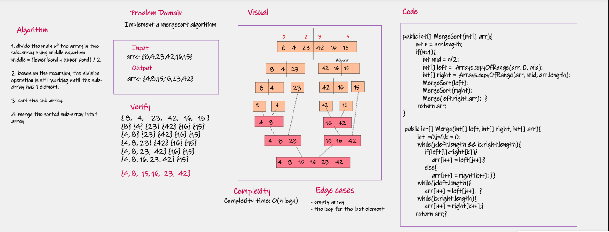
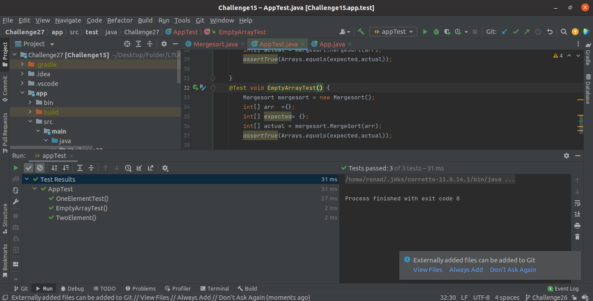
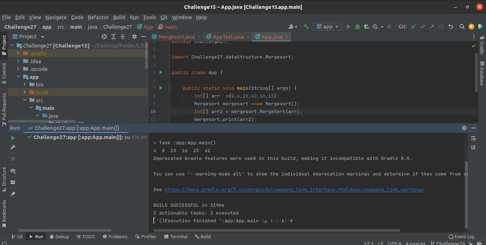

# Merge Sort

## Challenge Summary
<!-- Description of the challenge -->
---

Implementing Mergesort algorithm to sort array using Divide-and-conquer concept.
Read More about [Mergesort](BLOG.md) in my article.

## Whiteboard Process
<!-- Embedded whiteboard image -->
---

#### Selection sort Algorithm whiteboard

Link Of [whiteboard](https://wbd.ms/share/v2/aHR0cHM6Ly93aGl0ZWJvYXJkLm1pY3Jvc29mdC5jb20vYXBpL3YxLjAvd2hpdGVib2FyZHMvcmVkZWVtLzU2YjBmYzc4ZTAzOTQxNjU5ZDBiN2RkODVhNjE1NmJmX2ExNjJjNTMyLTdhMGMtNDY0NS05NmZkLTIwZDAxOWNmNGU1YV9kMjdlNjYxNy1mZjljLTRhNjItOWY1Mi0wYzFmZjkwMzdkOTg=)

## Approach & Efficiency
<!-- What approach did you take? Why? What is the Big O space/time for this approach? -->
---

**The time Complexity:**

- The average case : O( n logn)

## Solution
<!-- Show how to run your code, and examples of it in action -->
---

### The test on intelliJ

### The output of Implementation

