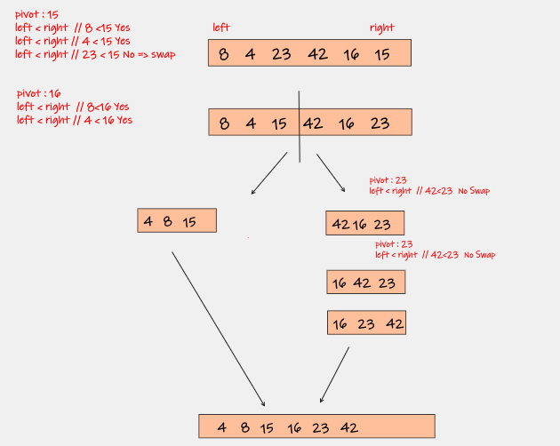

# Selection Sort

## Definition

---

Quicksort*1  is a divide-and-conquer algorithm. It works by selecting a `pivot` element from the array and partitioning the other elements into two sub-arrays, according to whether they are less than or greater than the pivot.

- The quicksort based on divide-and-conquer principle

## Algorithm Rules

---

Quicksort has 2 part: Partition and sort after the partition

1. Select pivot element in our situation we choose the right side

2. compare the element with the left side

3. if the pivot is less than the  element swap

4. divide the list into sub-list

5. repeat the steps above from 1-4

6. merge the sorted sub-array into 1 array

## Efficiency

---

**The time Complexity:**

- The average case : O(n log2n)

**The Space Complexity** is O(1)

## Example

---

## Resources

##### [*1 Wikipedia](https://en.wikipedia.org/wiki/Quicksort)