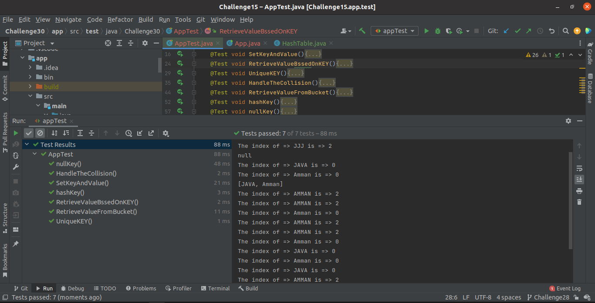
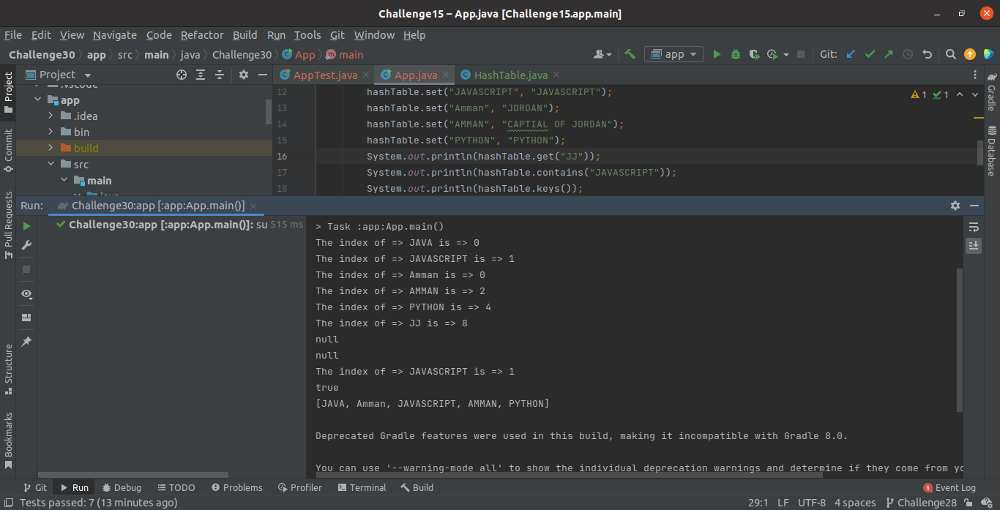

# Hash-Table

Hashing make the Search, insert, Delete, and Retrieve have O(1) time complexity

The Principle of Hashing is adding the Element inside the array in the same index of the Element

## Challenge
<!-- Description of the challenge -->

Implement the hash-Table, facing the Collision Problem and fixed it using the CHAINING approach

## Approach & Efficiency
<!-- What approach did you take? Why? What is the Big O space/time for this approach? -->
---

**The time Complexity:**

Average Case:

- set method : O(1)
- get method : O(1)
- keys method: O(n)

Worst  Case:

- set method : O(n)
- get method : O(n)
- keys method: O(n)

**The time Complexity:**

- The average case: O(n)

## API
<!-- Show how to run your code, and examples of it in action -->
---

HashTable implement the following methods:

- `set:` to add key and value  
- `getSize:` to return the length of the hash-table  
- `isEmpty:` to check if the hash-table is empty  
- `getBucketIndex:` to get the index of the node inside the bucket  
- `hashCode:` to hash the key.  
- `keys:` to retrieve all the keys inside the hashTable  
- `get:` To Retrieve the value of the key
- `contains:` to indicate if the key exists in the table already.

### The test on intelliJ

### The output of Implementation

