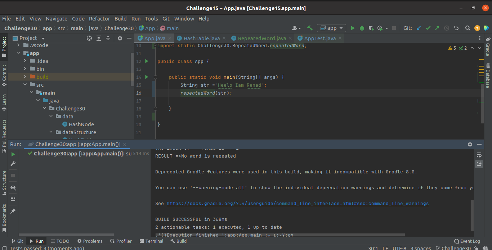

# Repeat Word using Hash

Repeated the word using hashMap

## Challenge
<!-- Description of the challenge -->

Creating the repeatedWord Function to retrieve the last word was repeated in sentence.

## Approach & Efficiency
<!-- What approach did you take? Why? What is the Big O space/time for this approach? -->
---

**The time Complexity:**

Average Case:

- get method : O(1)
- repeated Function: O (n)

Worst  Case:

- get method : O(n)
- repeated Function: O (n)

## API
<!-- Show how to run your code, and examples of it in action -->
---

To Find the repeated word we using the hashTable we are built before in [Challenge30](../Challenge30) which Implements the following methods:

- `set:` to add key and value  
- `getSize:` to return the length of the hash-table  
- `isEmpty:` to check if the hash-table is empty  
- `getBucketIndex:` to get the index of the node inside the bucket  
- `hashCode:` to hash the key.  
- `keys:` to retrieve all the keys inside the hashTable  
- `get:` To Retrieve the value of the key
- `contains:` to indicate if the key exists in the table already.

> To Find the repeated words in sentence we used the get method to check if the value of the key is null or not

### The test on intelliJ

### The output of Implementation

