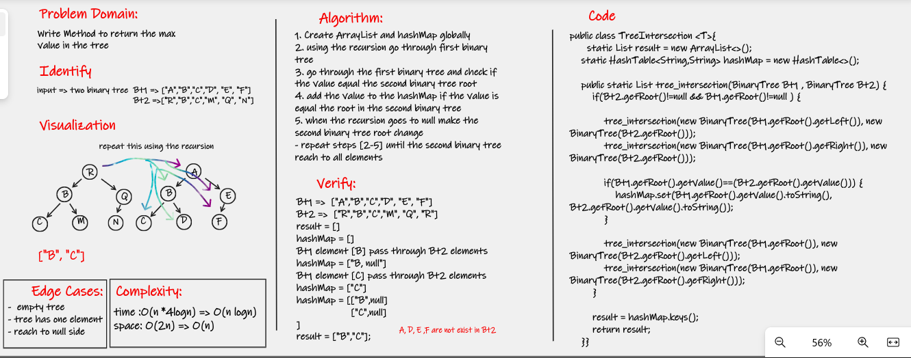
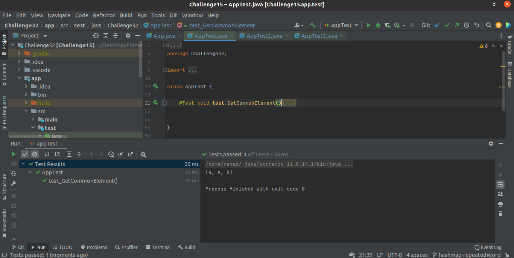
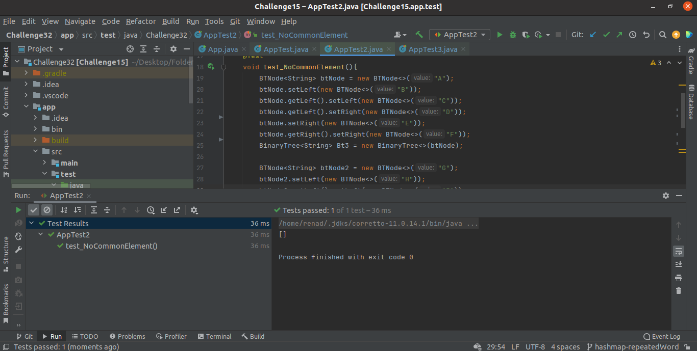
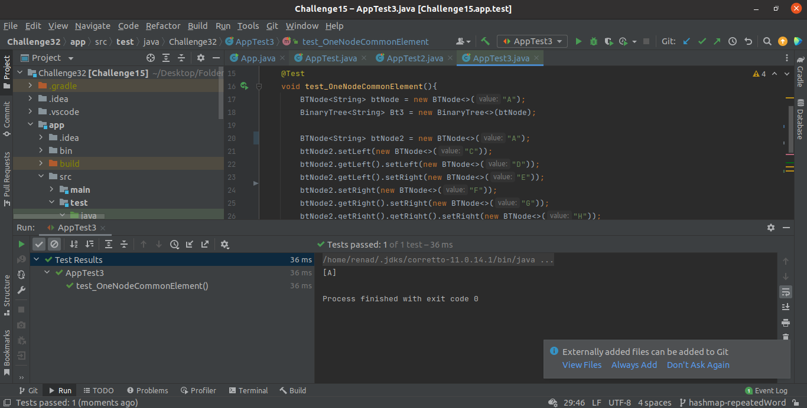
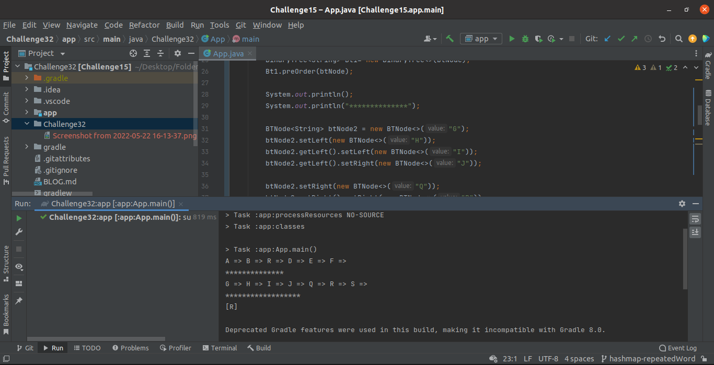

# tree intersection using Hash

discover the intersection in two binary tree

## Challenge
<!-- Description of the challenge -->

Creating the tree_intersection Function to retrieve the the elements exist in both of the binary trees.

## whiteboard

[Link of whiteboard](https://wbd.ms/share/v2/aHR0cHM6Ly93aGl0ZWJvYXJkLm1pY3Jvc29mdC5jb20vYXBpL3YxLjAvd2hpdGVib2FyZHMvcmVkZWVtLzYzMWQxMWJjZGI0MTRiZDE5OTI3NDhjOTkxZGE0ZDdjX2ExNjJjNTMyLTdhMGMtNDY0NS05NmZkLTIwZDAxOWNmNGU1YV8wM2VmZDU5Ni1kNTQ2LTQxYmUtOGZiNS0xOWI4MGNlNTY3ODE=)

## Approach & Efficiency
<!-- What approach did you take? Why? What is the Big O space/time for this approach? -->
---

**The time Complexity:**

Average Case:

- tree intersection : O (4 * n * logn) => O(n logn)

**The time Complexity:**

- tree intersection : O (2n) => O(n)

## API
<!-- Show how to run your code, and examples of it in action -->
---

To Find the repeated word we using the hashTable we are built before in [Challenge32](../Challenge30) which Implements the following methods:

- `set:` to add key and value  
- `getSize:` to return the length of the hash-table  
- `isEmpty:` to check if the hash-table is empty  
- `getBucketIndex:` to get the index of the node inside the bucket  
- `hashCode:` to hash the key.  
- `keys:` to retrieve all the keys inside the hashTable  
- `get:` To Retrieve the value of the key
- `contains:` to indicate if the key exists in the table already.

> To Find the repeated words in sentence we used the get method to check if the value of the key is null or not

### The test on intelliJ

**TEST 1:**

---

**TEST 2:**

---

**TEST 3:**

---

### The output of Implementation

