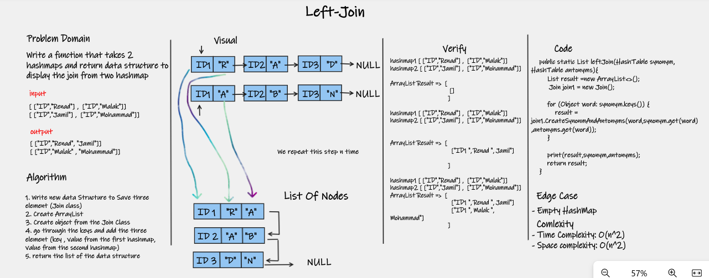

# Hashmap LEFT JOIN
<!-- Short summary or background information -->

Write a function that LEFT JOINs two hashmaps into a single data structure.

## whiteboard
<!-- Description of the challenge -->

## Approach & Efficiency
<!-- What approach did you take? Why? What is the Big O space/time for this approach? -->
Time Complexity: O(n^2)
space Complexity: O(n^2)

## Solution
<!-- Embedded whiteboard image -->

The steps to run this code in your machine:  

1. Clone the the repo to your local machine.  
2. Open the project in IntelliJ IDE
3. Then, create the configuration to the App (New Application) and Test (Junit) As the Figure below Show:

4. Run the project and test it in intelliJ environment  
 `OR`
test the code in terminal:

> `renad@renad-HP-Notebook:~/data-structures-and-algorithms/Challenge11$` ./gradlew test  
