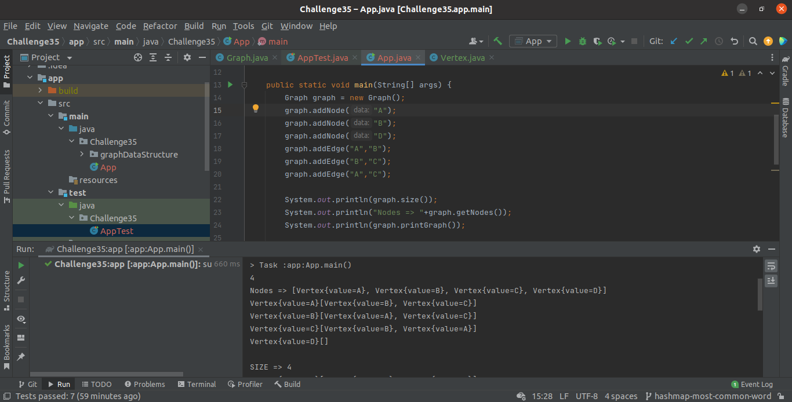
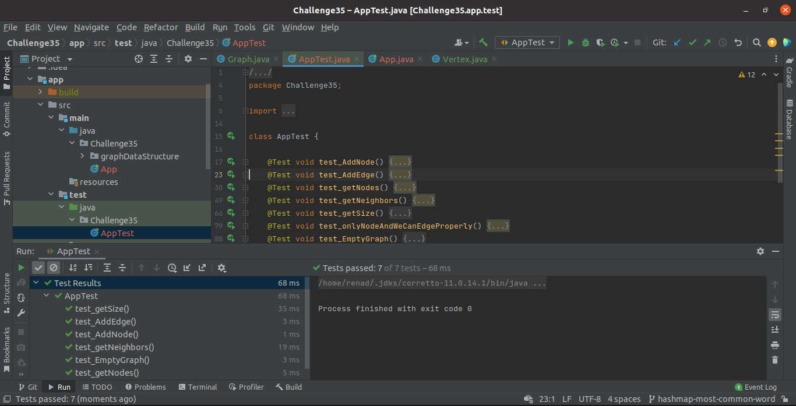

# Graphs
<!-- Short summary or background information -->

A Graph is a non-linear data structure consisting of nodes and edges. The nodes are sometimes also referred to as vertices and the edges are lines or arcs that connect any two nodes in the graph.

## Challenge
<!-- Description of the challenge -->

---

Graph Implementation structure and methods:
add node, add edge, get nodes, get neighbors, and get the size.

## Approach & Efficiency
<!-- What approach did you take? Why? What is the Big O space/time for this approach? -->
---

**Time complexity:**

Adjacency List: O(n)  
Adjacency matrix: O(1)  

add node: O(1)  
add edge:O(n)  
get nodes: O(n)  
get neighbors: O(n)  
size: O(1)  

**Space complexity:**

Adjacency List: O(n+2e)  
Adjacency matrix:O(n^2)  

add node: O(1)  
add edge: O(1)  
get nodes:O(n)  
get neighbors: O(n)  
size: O(1)  

## API
<!-- Description of each method publicly available in your Graph -->

---
The steps to run this code in your machine:  

1. Clone the the repo to your local machine.  
2. Open the project in IntelliJ IDE
3. Then, create the configuration to the App (New Application) and Test (Junit) As the Figure below Show
4. Run the project and test it in intelliJ environment  

  

## Result

---

**OUTPUT:**

**TEST:**
