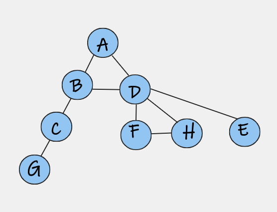
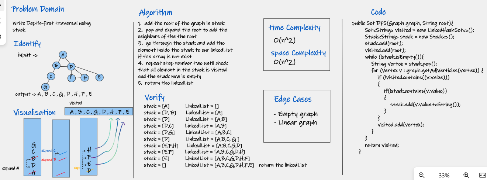
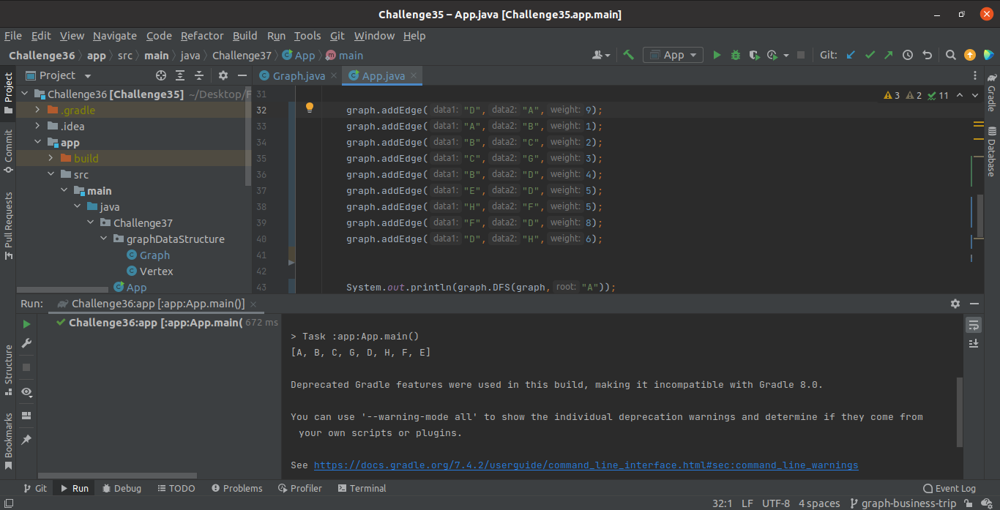
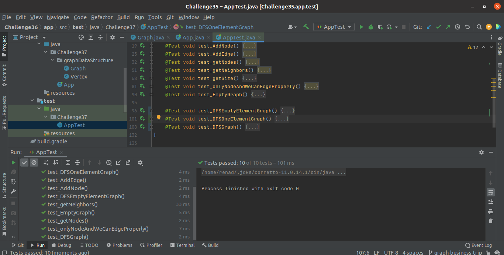

# Graphs - DFS
<!-- Short summary or background information -->

## Challenge
<!-- Description of the challenge -->

---

write a Depth-First traverse method Implementation using LinkedList and stack

**Graph:**

**OUTPUT:**

## Whiteboard Process

---

Link of [whiteboard](https://wbd.ms/share/v2/aHR0cHM6Ly93aGl0ZWJvYXJkLm1pY3Jvc29mdC5jb20vYXBpL3YxLjAvd2hpdGVib2FyZHMvcmVkZWVtL2UxZjAxN2Y4ZTdiNzRlZmZiMzliYTRkOGI1YzE0MmQxX2ExNjJjNTMyLTdhMGMtNDY0NS05NmZkLTIwZDAxOWNmNGU1YV9jYmFmYWY3Ny0yNGFjLTQ3NDktYmY4Yy1iOWFmMTMxMjkyODM=)

## Approach & Efficiency
<!-- What approach did you take? Why? What is the Big O space/time for this approach? -->
---

**Time complexity:**

O(n^2)  
**Space complexity:**

O(n^2)

## API
<!-- Description of each method publicly available in your Graph -->

---
The steps to run this code in your machine:  

1. Clone the the repo to your local machine.  
2. Open the project in IntelliJ IDE
3. Then, create the configuration to the App (New Application) and Test (Junit) As the Figure below Show
4. Run the project and test it in intelliJ environment  

  

## Result

---

**OUTPUT:**

**TEST:**
